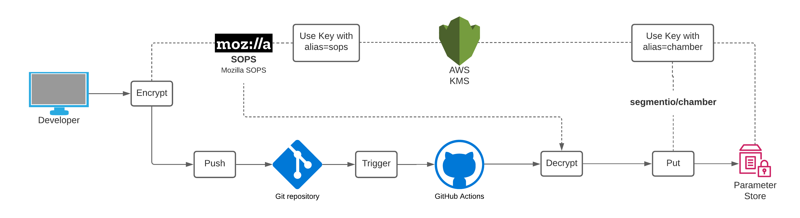
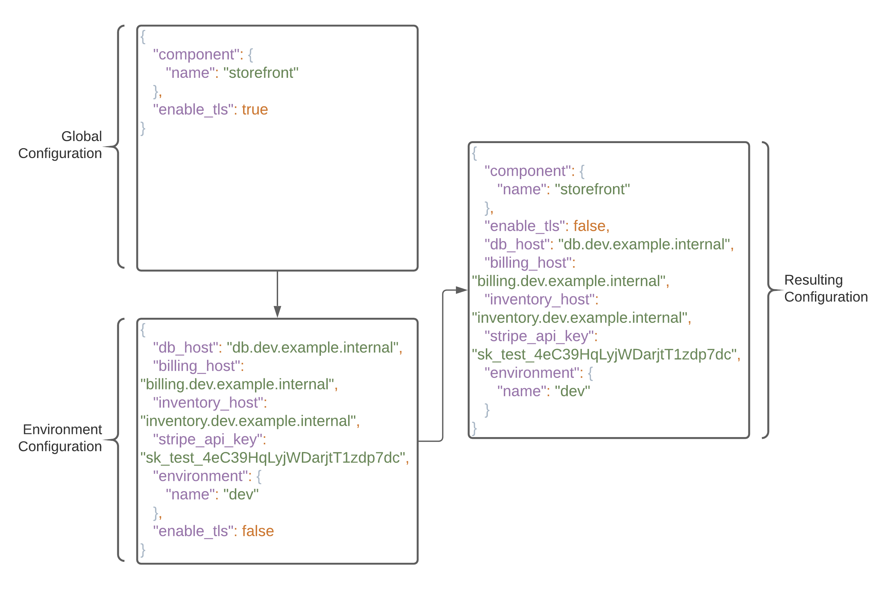

# AWS Parameter Store Pipeline

## Purpose

AWS Parameter Store provides for a convenient and secure way (through KMS encryption) to store parameters that will be used in components running on AWS (through the ability for AWS services and AWS API clients to reference secrets via Parameter Store ARNs).

The issue however, is that once AWS Parameter Store becomes the centralized configuration solution for an set of components, AWS Parameter Store becomes the source of truth for configuring those components. This goes against the principle of GitOps, because these parameters need to be versioned in a git repository such that their changes can be tracked.

An AWS Parameter Store Pipeline is a CI pipeline responsible for taking parameters encrypted and versioned in git, and updating their corresponding locations in AWS Parameter Store.

The following are areas of responsibilities involved in this process:
* Versioning/Structure
* Encryption
* Continuous Integration
* Consumption/Hierarchy

## Versioning / Structure

The Parameter Store Pipeline must version the parameters in a structured fashion such that allows for versioning both global and environment-specific parameters per service.

The top level set of directories correspond to each service. Within each service directory, there are directories for each environment, and also one for global configurations common to all environments for that particular service:

```
├── petshop-billing
│   ├── dev
│   │   └── config.json
│   ├── global
│   │   └── config.json
│   ├── prod
│   │   └── config.json
│   ├── qa
│   │   └── config.json
│   └── uat
│       └── config.json
├── petshop-inventory
│   ├── dev
│   │   └── config.json
│   ├── global
│   │   └── config.json
│   ├── prod
│   │   └── config.json
│   ├── qa
│   │   └── config.json
│   └── uat
│       └── config.json
└── petshop-storefront
    ├── dev
    │   └── config.json
    ├── global
    │   └── config.json
    ├── prod
    │   └── config.json
    ├── qa
    │   └── config.json
    └── uat
        └── config.json
```

### Encryption and Continuous Integration



The parameters stored in the git repository need to be encrypted prior to being pushed upstream. This is done via [mozilla/sops](https://github.com/mozilla/sops), which encrypts all the values in the JSON files using a dedicated symmetric key in KMS.

Helper scripts for the developer to decrypt the keys when editing them exist:


| Script Purpose | Location |
| ------------- | ------------- |
| Decryption for Editing | [decrypt.sh](decrypt.sh) |
| Encryption before Pushing Upstream | [encrypt.sh](encrypt.sh) |

Additional protection measures for not pushing unencrypted values upstream include pre-commit git hooks, however those need to be enabled explicitly by the developer anyhow.

Once the encrypted values are pushed upstream, a [GitHub Actions Workflow](.github/workflows/update-parameter-store.yml) is triggered. The workflow uses SOPS to decrypt the parameters, and then uses [segmentio/chamber](https://github.com/segmentio/chamber) to push these values to AWS Parameter Store, where they will be encrypted via a secondary symmetric key.

The script performing the write to AWS Parameter Store via Chamber is [chamber-write.py](chamber-write.py).

### Consumption



When the parameters are read for each service, the configuration is merged using a hierarchy where the global configuration is overwritten by the environment-specific configuration.

A helper script to render such a configuration is [get_config.sh](get_config.sh).

